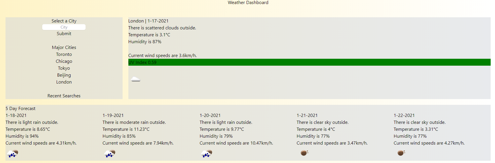

# Weather Dashboard
**UofT Coding Bootcamp Week 6 Challenge - Coding Quiz**
🔗 [Link to deployment page](https://terrencejchan.github.io/weather-dashboard/)  

This app displays the weather of the user's selected city, as well as their 5 day forecast! Built using a Tailwind CSS (with Post CSS), this app was an experimental creation using a new framework.

## How it Works
The page first initializes with with information of Waterloo (Ontario)'s weather by fetching information from the **openweathermap** API. It populates the page with information, and displays the 5-day forecast underneath it.

## Search
The left box allows the user to enter a city, in which the the page would populate weather information for the desired city. Users can also select a city from the Major Cities list.

As the user enters different cities, recent search queries will be saved into localStorage, where it will populate the five most recent searches. These cities may also conveniently be quickly selected to populate the page with the city's weather.